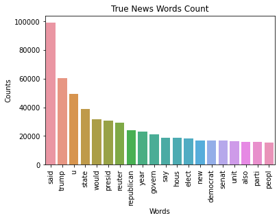
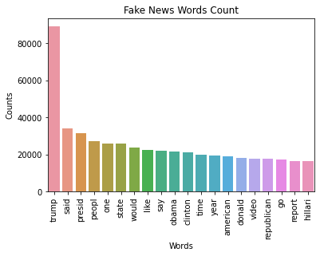
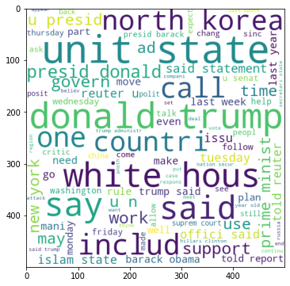
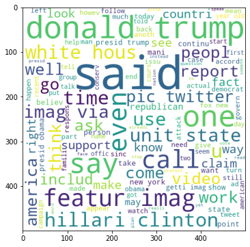

# fake-news-detector
A research &amp; proof-of-concept project that detects likely fake news using classical machine learning models and exposes the prediction functionality via a Telegram bot. The project includes data processing and correlation analysis notebooks, trained models and a simple async bot for automated alerts and subscription-based mailing.

## Features

* Text preprocessing and exploratory analysis (frequency analysis, word clouds, correlation plots).
* Trained vectorizer and classical models (Logistic Regression, Linear Regression).
* Telegram bot (aiogram, async) that:

  * checks a news item and returns a prediction + author reliability stats,
  * shows the top trusted authors,
  * supports subscription mailing (sends alerts to all subscribed Telegram users when a news item is predicted fake).
* Local SQLite DBs to track author reliability and subscribers.

## Project structure

```
.
├── add_author.py
├── bot.py
├── jupyter_correlation/
│   ├── authors_reliability.ipynb
│   ├── corr_without_stemming.ipynb
│   ├── corr_with_stemming.ipynb
│   └── prod_corr.ipynb
├── main.ipynb
├── main_datasets/
│   ├── Fake.csv.zip
│   └── True.csv.zip
├── main_db/
│   ├── confidence.db    # author_id, author_name, count_true, count_fake
│   └── mail.db          # user_id, telegram_id (subscribers list)
├── mailing.py
├── news_check.py
├── README.md
├── requirements.txt
├── save_train/
│   ├── LinearRegression_model.sav
│   ├── LogisticRegression_model.sav
│   └── vectorizer.pk
├── top_authors.py
└── LICENSE
```

## Files of interest

* `main.ipynb` — model development, experiments and training steps.
* `jupyter_correlation/*` — notebooks for correlation and analysis (frequency counts, word clouds, sentiment/correlation plots).
* `save_train/` — persisted models and vectorizer used by `bot.py`.
* `main_db/` — two SQLite databases: `confidence.db` and `mail.db`.
* `bot.py` — Telegram bot (aiogram, asynchronous).
* `news_check.py`, `add_author.py`, `top_authors.py`, `mailing.py` — utility scripts for project features.

### Exploratory analysis


*Figure: Frequency analysis for true news.*


*Figure: Frequency analysis for fake news.*


*Figure: Word cloud for true news.*


*Figure: Word cloud for fake news.*


*Figure: Correlation between article sentiment and probability of being fake.*

## Installation (cross-platform)

**Requirements:** Python 3.8+ recommended.

1. **Clone**

```bash
git clone https://github.com/YLukashov/Fake_news.git
cd Fake_news
```

2. **Create & activate a virtual environment (recommended)**

* macOS / Linux (bash / zsh)

```bash
python3 -m venv .venv
source .venv/bin/activate
```

* Windows (PowerShell)

```powershell
python -m venv .venv
.\.venv\Scripts\Activate.ps1
# or, in cmd.exe:
.\.venv\Scripts\activate.bat
```

3. **Install dependencies**

```bash
pip install --upgrade pip
pip install -r requirements.txt
```

4. **Configure Telegram token**

Two safe options:

* **Environment variable** (recommended)

  * macOS / Linux:

  ```bash
  export TELEGRAM_TOKEN="YOUR_TOKEN"
  ```

  * Windows (PowerShell):

  ```powershell
  $env:TELEGRAM_TOKEN="YOUR_TOKEN"
  ```

  In `bot.py`, read `TELEGRAM_TOKEN` (preferred over storing secrets in files).

* **config.py** (alternative / quick start)

  Create `config.py` in project root:

  ```py
  TOKEN = "YOUR_TOKEN"
  ```

  If you use `config.py`, add `config.py` to `.gitignore` and do not commit it.

5. **Run the bot**

```bash
python bot.py
```

6. **Open notebooks**
   To reproduce analysis or retrain models:

```bash
jupyter notebook
# or
jupyter lab
```

Open `main.ipynb` and the notebooks in `jupyter_correlation/` and run cells as needed. 

## Usage (bot)

* `/check <text or url>` — check article text or URL (implementation depends on `news_check.py`).
* `/top_authors` — show top 10 authors by reliability.
* `/subscribe` — add your Telegram user to `main_db/mail.db` for mailing alerts.
* `/unsubscribe` — remove from mailing list.

(Adjust exact commands to the names used in `bot.py`.)

## Databases & saved models

* `main_db/confidence.db` — stores author reliability: (`author_id`, `author_name`, `count_true`, `count_fake`).
* `main_db/mail.db` — stores subscribers (`user_id`, `telegram_id`).
* `save_train/` — serialized models and vectorizer; used by `bot.py` to make predictions without re-training.

## Notes / future work

* Migrate DBs to a remote storage for persistence and concurrency (PostgreSQL, etc.).
* Expand author metadata (profiles, source links).
* Improve predictive performance with larger datasets and ensemble models.
* Add admin controls for mailing thresholds and moderation.

## Contributing

If you want to contribute:

1. Fork the repository.
2. Create a branch `feature/your-change`.
3. Submit a pull request describing the change (data, model, bot feature).

## License

MIT License — see `LICENSE` file.
